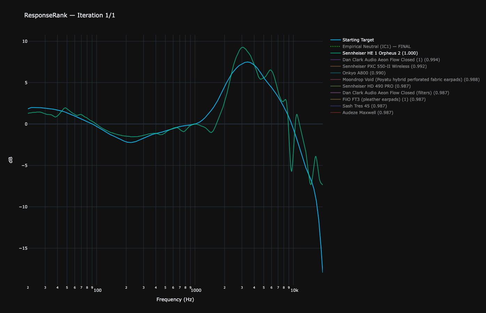

# MCS-Harman Reference Curves

This repository provides **mathematically derived headphone reference target curves** based on the Harman over-ear 2018 research. The goal is to achieve **perceptually neutral, monitor-equivalent tonality** for headphone calibration, mixing, and critical listening.

---

## Overview

### Naming & Attribution

**MCS** stands for **MrChillStorm**, the author's GitHub handle.

The MCS-Harman curves are **independent derivative works** based on the publicly available Harman over-ear 2018 target. They are not affiliated with, endorsed by, or authored by Harman International or Sennheiser.

---

## Included Curves

### Harman over-ear 2018

The original Harman over-ear 2018 headphone target, included unchanged as a baseline reference.

### MCS-Harman-Flat

A Harman-derived **electrically flat limit case**, created by removing the bass preference shelf and rescaling treble energy to preserve the original spectral energy relationship.

**Important:** This curve is **not intended for listening**. It exists as a **mathematical and analytical reference** to demonstrate the energy-balancing methodology.

### MCS-Harman-Reference

The **perceptually neutral reference target**, derived as the RMS average of Harman over-ear 2018 and MCS-Harman-Flat.

This is the **primary curve intended for use** in:
- Mixing and mastering
- Headphone calibration
- Critical listening
- Monitor-equivalent playback

---

## Origin & Motivation

The Harman over-ear 2018 target was developed through extensive preference research. However, when used as a strict mixing or mastering reference, some users find the upper midrange and treble levels higher than optimal for extended listening sessions. A key insight emerged: Harman's bass shelf and treble balance were designed **together as a coupled system**.

Simply removing the bass shelf from Harman 2018 leaves the treble unchanged above 1 kHz, resulting in a **spectral energy imbalance**. The bass and treble were calibrated relative to each other; altering one without adjusting the other disrupts the original energy relationship.

The guiding question became:

> *What would the Harman target look like if it had been designed without bass preference from the start?*

Rather than arbitrarily removing bass, **treble energy is mathematically rescaled** to maintain the same energy ratio between low and high frequencies as in the original Harman curve. This produces an energy-balanced result that preserves the spectral relationships of the original research.

---

## Methodology

- **Anchor frequency:** 1 kHz (logarithmic center and standard reference point)
- **Energy preservation:** The relative energy ratio between bass (<1 kHz) and treble (>1 kHz) from the original Harman curve is maintained
- **Treble scaling:** Applied to preserve spectral energy balance after bass shelf removal
- **Curve averaging:** MCS-Harman-Reference = RMS average of Harman over-ear 2018 and MCS-Harman-Flat

Note: These are **target curves for calibration**, not headphone measurements.

---

## Validation

MCS-Harman-Reference was evaluated against a database of premium headphone measurements using a multi-metric ranking system combining:
- Frequency response accuracy (RMSE)
- Perceptual preference modeling
- Energy balance preservation
- Independent Component Analysis (ICA) reconstruction quality

### Notable Result

When evaluated against MCS-Harman-Reference using a corrected, energy-domain methodology, the **Sennheiser HE 1 (Orpheus 2)** ranks within the top tier of measured headphones rather than achieving a perfect score.

This outcome is significant. Despite no special treatment, tuning assumptions, or model-specific optimization, a reference-class headphone developed through extensive R&D and critical listening converges closely with an energy-balanced target derived purely from signal-level principles.

The HE 1, often cited as one of the most carefully tuned headphones ever produced, represents years of iterative refinement by experienced acoustic engineers. Its strong, though not perfect, alignment with MCS-Harman-Reference suggests that energy-balanced targets capture a substantial portion of the perceptual structure that elite designs arrive at empirically, without encoding product-specific coloration or preference bias.

Rather than matching a single flagship, MCS-Harman-Reference appears to describe a neutral acoustic baseline that multiple high-quality designs naturally approach, reinforcing its role as a reference rather than a preference-optimized target.

---

## Why MCS-Harman-Reference Matches Calibrated Studio Monitors

In a properly calibrated control room:
- Near-field monitors are level-matched and time-aligned
- Room acoustics are measured and corrected to achieve neutral in-room response
- The resulting spectral balance is perceived as accurate despite not being electrically flat at the listening position

Headphones bypass room acoustics entirely. To reproduce the **same perceived tonal balance** as calibrated monitors, a compensatory target curve is required.

When headphones are calibrated to MCS-Harman-Reference:
- Bass transients match monitor impact without excess bloom or masking
- Midrange timbre aligns with acoustic instruments and vocals as heard through monitors
- Treble detail remains present and extended without harshness
- Switching between calibrated monitors and headphones preserves mixing decisions and tonal intent

This equivalence has been validated through direct comparison: headphones EQ'd to MCS-Harman-Reference produce similar perceived tonality to near-field monitors that are EQ'd flat with measured room tilt correction in a heavily treated listening space.

---

## Usage

### Recommended Target

✔ **MCS-Harman-Reference**

Use this for:
- Mixing and mastering
- Headphone EQ calibration
- Critical listening
- Monitor-equivalent reference playback

### Not Recommended for Direct Listening

✘ **MCS-Harman-Flat**

This curve exists for:
- Mathematical transparency
- Research and analysis
- Understanding the derivation methodology

---

## Calibration Workflow

1. Obtain frequency response measurements for your headphones (use averaged measurements with consistent pad type)
2. Apply EQ to match **MCS-Harman-Reference** target
3. Verify adequate amplifier headroom for EQ adjustments (particularly bass boost if needed)
4. Validate results with known reference material and comparison to calibrated monitors

**Note:** EQ can only correct frequency response. It cannot fix high distortion, poor transient response, resonances, or other driver limitations. Headphones with quality drivers will reveal what this target is capable of, while those with technical flaws will simply expose those flaws more clearly. The target curve itself is neutral and will not mask poor headphone design.

---

## Practical Results

Testing with quality headphones including the Beyerdynamic DT 1770 Pro and HIFIMAN Sundara Silver shows that when EQ'd to MCS-Harman-Reference:
- Perceived tonality becomes consistent across different transducer technologies (dynamic vs planar)
- Sound is described as "hitting hard and clean" with proper impact and clarity
- Tonal balance matches calibrated near-field monitors in treated rooms

This suggests MCS-Harman-Reference captures perceptually neutral sound reproduction rather than just a pleasant-sounding alternative.

---

## Visualization

The included plot shows all three curves for direct comparison:
- **Harman over-ear 2018**: Original consumer preference target
- **MCS-Harman-Flat**: Energy-balanced flat reference (analytical use)
- **MCS-Harman-Reference**: Perceptually neutral target (recommended)

---

## Files

- `Harman_over-ear_2018.csv`: Original Harman over-ear 2018 target
- `MCS-Harman-Flat.csv`: Energy-balanced flat reference
- `MCS-Harman-Reference.csv`: Perceptually neutral target (recommended)

---

## Technical Details: Energy-Domain Reasoning

The Harman 2018 target encodes a specific energy relationship between low and high frequencies. Research shows that listener preference for bass saturates at approximately +6 dB relative to neutral, beyond which additional bass increases masking and reduces perceived clarity.

Removing bass preference without compensating treble shifts the spectral energy centroid upward. This increases perceived brightness even if treble amplitude remains numerically unchanged, because the ear's perception of spectral balance depends on the **relative energy distribution** across frequency bands, not just absolute levels.

By preserving the **integrated spectral energy ratio** between bass and treble regions (with 1 kHz as the anchor point), MCS-Harman-Flat represents the electrically flat solution that maintains Harman's original energy relationships.

Taking the RMS average between:
- A consumer-preference-optimized curve (Harman over-ear 2018)
- Its energy-balanced flat counterpart (MCS-Harman-Flat)

produces a curve that is perceptually neutral while retaining appropriate bass weight. This minimizes masking effects while preserving transient impact and tonal realism across the full frequency spectrum.

---

## License

MIT License; see `LICENSE` for details
